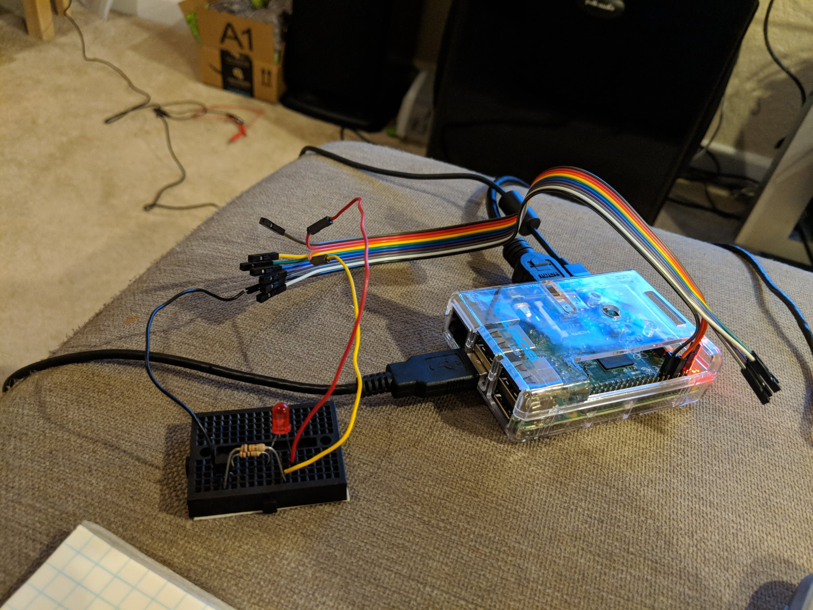
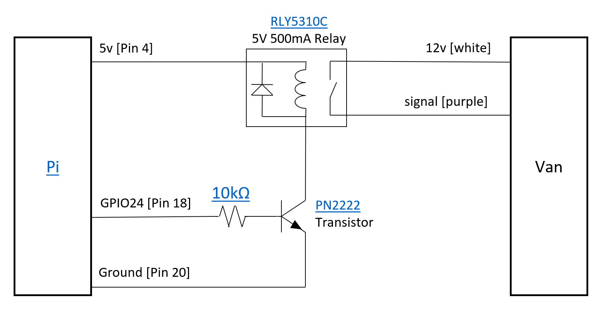
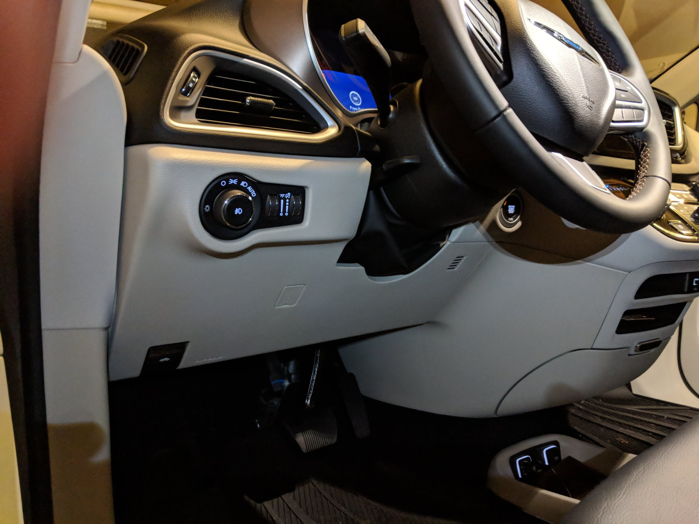
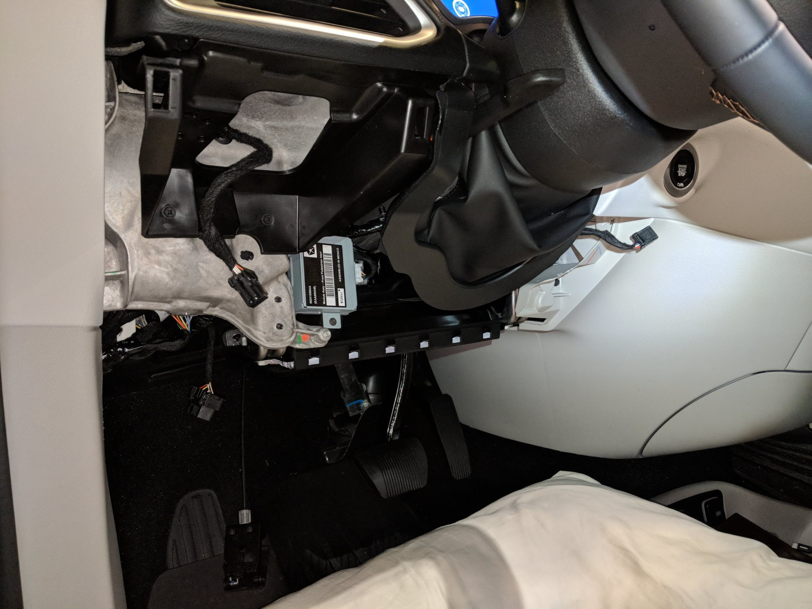
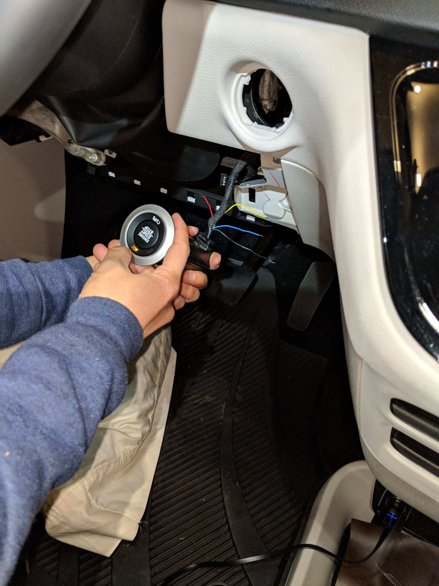
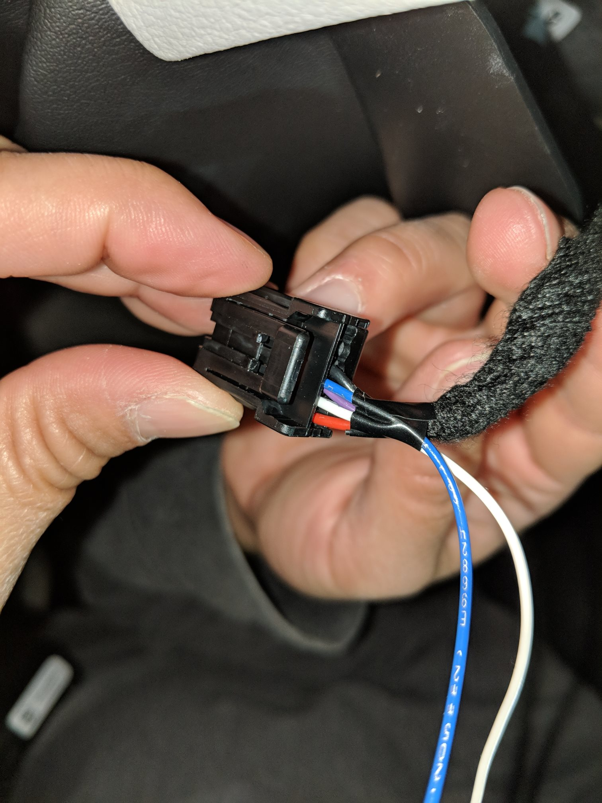

We wanted to camp overnight in our 2018 Chrysler Pacifica Hybrid. If the van is plugged in or the battery is charged enough, the climate system can run overnight without the engine turning on. Unfortunately, the van turns itself off after 30 minutes if left in Park (or while charging). 

Also see the <a href="VanBuild">Van Build guide</a> for how we set the van up for sleeping, once we figured out how to keep it on.

We built a simple device which turns the van off and on again every 28 minutes, so that the climate system stays on all night. Here's a quick video of it working - look at the lights on the Start Button to see the car turn off and back on.

<video width="640" height="360" controls>
 <source src="images/walkthrough/QuickDemo.mp4" type="video/mp4" />
</video>

The device uses a Raspberry Pi computer to control the timing, and a simple circuit with a transistor and relay which basically just touch two wires from the Start Button together, acting just like when the Start Button is pressed. This design leaves the security of the car intact - a key fob is still required to start it. The program turns the car off and on again every 28 minutes for 12 hours after the Raspberry Pi is turned on.

The Raspberry Pi is powered by the USB outlet in the floor, which can be set to always be powered by moving the fuse F95 to the alternate position in the fuse box under the hood.

The wire connected to the Start Button in the car just has the wires inserted into the wiring harness plugged into the Start Button and then taped with electrical tape, so that it's fully removeable. On the other end it connects to the circuit with a barrel connector, so that the computer can be fully disconnected from the car when it's not being used overnight.

You'll need soldering skills and a soldering iron and to know how to set up a Raspberry Pi computer to build this device.

## Tools
<table>
<tr><td markdown="span">Multimeter</td></tr>
<tr><td markdown="span">Soldering Iron, Solder, Wire</td></tr>
<tr><td markdown="span">[Mini HDMI to HDMI Cable](https://www.adafruit.com/product/2775)</td></tr>
<tr><td markdown="span">USB Hub, Keyboard, and Mouse</td></tr>
<tr><td markdown="span">Test [LED](https://vetco.net/products/nte30036-blue-led-3mm/nte30036), 330Ω Resistor, [Breadboard](https://vetco.net/products/170-point-mini-breadboard-white/vupn6674)</td></tr>
</table>

## Parts
<table>
<tr><th>Description</th><th>Price</th></tr>
<tr><td markdown="span">[Raspberry Pi Zero WH](https://www.adafruit.com/product/3708)</td><td markdown="span">$14</td></tr>
<tr><td markdown="span">[Raspberry Pi Zero Case](https://www.adafruit.com/product/3252)</td><td markdown="span">$5</td></tr>
<tr><td markdown="span">[Mini HDMI to HDMI Adapter](https://www.adafruit.com/product/2819)</td><td markdown="span">$3</td></tr>
<tr><td markdown="span">[8GB Micro SD Card](https://www.adafruit.com/product/2820)</td><td markdown="span">$10</td></tr>
<tr><td markdown="span">Micro USB Cable</td><td></td></tr>
<tr><td markdown="span">[10kΩ Resistor](https://vetco.net/products/10k-ohm-1-4-watt-resistor)</td><td markdown="span">$1</td></tr>
<tr><td markdown="span">[PN2222 Transistor](https://vetco.net/products/2n3904-bc547-pn2222-2n4401-npn-transistor-5pk-nte123ap-5/nte123ap-5)</td><td markdown="span">$1</td></tr>
<tr><td markdown="span">[RLY5310C Relay](https://vetco.net/products/relay-5vdc-6vdc-spst-no-500-ma)</td><td markdown="span">$5</td></tr>
<tr><td markdown="span">[66 x 66 x 28mm ABS Project Box](https://vetco.net/products/66-x-66-x-28mm-abs-box-black/ham-1593jbk)</td><td markdown="span">$4</td></tr>
<tr><td markdown="span">[20 PIN DIP IC Protoboard](https://vetco.net/products/20-pin-dip-ic-pattern-protoboard-1-8-x-3-6-qty-2/vupn8048)</td><td markdown="span">$3</td></tr>
<tr><td markdown="span">[2.1mm Mount Jack](https://vetco.net/products/2-1mm-dc-power-panel-mount-jack-ph-2112/ph-2112)</td><td markdown="span">$3</td></tr>
<tr><td markdown="span">[2.1mm Plug and Cable](https://vetco.net/products/2-1mm-dc-power-plug-right-angle-w-6-cable/ph-tc210)</td><td markdown="span">$3</td></tr>
<tr><td markdown="span">[Female-Female Breadboard Jumper Wire](https://vetco.net/products/8-5-female-female-rainbow-breadboard-jumper-wire-for-arduino-10-pack/vupn6981)</td><td markdown="span">$4</td></tr>
</table>

# Instructions

## Warnings
* Follow these instructions at your own risk. It's not too hard, but you could certainly break something on your new car.
* Be careful removing panels and harnesses.
* Test the wires from the Start Button with a multimeter first - make sure you have the right ones. The colors might not be the same in all cars; it was white (12v) and purple (signal) for ours.
* Ensure the wires are connected securely on the car side and are insulated so they can't accidentally touch and turn off the car unexpectedly.
* Disconnect the circuit from the car whenever driving so that it can't turn the car off unexpectedly. We used a 2.1mm DC plug to make the circuit easy to disconnect.
* Leave a window cracked open when using this, so that if the car does turn off for some reason, you still have ventilation.
* Test this at home a few times before using it on the road to make sure everything is working reliably.

## Set up SD Card
* Set up the SD card with <a href="https://www.raspberrypi.com/software/">'Raspberry Pi Imager'</a> on a PC or Mac.
  * Choose 'Raspberry Pi OS (Other)', then 'Raspberry Pi OS Lite (32-bit)'.
  * Click the gear icon.
    * Check 'Set hostname' (the default is fine).
    * Check 'Set username and password' (username 'pi', password is up to you).
    * Check 'Configure wireless LAN' and provide your home Wifi network name and password.
    * Check 'Set locale settings' and provide your Time Zone and Keyboard layout.
    * Click Save
  * Click Write.

## Set up Raspberry Pi
Put the SD card in the Pi Zero, connect a monitor and keyboard, and connect power to boot it. Once it settles at a command prompt, run:

* sudo apt update
* sudo apt upgrade
* sudo apt-get install git-core
* cd /home/pi
* git clone https://github.com/WiringPi/WiringPi
* cd WiringPi
* ./build
* cd /home/pi
* git clone https://github.com/ScottLouvau/PacControl
* cd PacControl/src
* chmod +x build
* ./build

## Test PacControl
Connect an LED and resistor between pin 18 (program will blink) and pin 20 (ground).
(Pin 1 has a square outline. Pin 2 is next to it. Going down the line, it's Pin 4, 6, 8, ...).

On the Pi command prompt, run:
/home/pi/PacControl/src/pacControl

You should see "1: +-+-+-" as output. The LED should blink three times.

## Set PacControl to run on startup
On the Pi command prompt, run:
sudo nano /etc/rc.local

Add a line just before "exit 0" which says:
/home/pi/PacControl/src/pacControl >> /home/pi/PacControl/src/pacControl.log &

Press Ctrl+S and Ctrl+X to save.

Disconnect and reconnect power from the Pi. Confirm that after about 30 seconds, the LED blinks three times.

## Circuit Assembly
Solder together the circuit as shown in the circuit diagram. Carefully check that the relay and transistor are connected in the right order.

* On the <a href="images/PN2222.PNG">transistor</a>, the relay connects to the 'collector', the resistor to the 'base', and ground to the 'emitter'. If you hold the transistor with the round side on the left, the pins going from top to bottom are collector, base, emitter.
* On the <a href="images/5310C.PNG">relay</a>, pin 3 must connect to 5v on the Raspberry Pi and pin 5 to the transistor collector. Pins 1 and 7 (the outer two) connect to the 2.1mm mount jack (in any order). The relay pins are numbered 1, 3, 5, and 7, with the 'notch' on the chip next to pin 1.
* Drill a hole into the project box to mount the 2.1mm jack. Try not to heat the jack too much when soldering it. 
* Drill a hole for the breadboard jumper wires and connect to the Raspberry Pi - red to 5V (pin 4), black to ground (pin 6), grey to GPIO24 (pin 18). These are the second, third, and eighth pins on the edge of the Pi from the left side, if the Raspberry icon is upright.
* Test the complete circuit by connecting the 5v pin to one of the 2.1mm jack contacts and the LED and resistor between the other contact and ground. It should turn on three times as when connected to the Pi directly.

## Van Cable Installation
* Remove the plastic panel under the steering wheel. It's held in place by clips; make sure to remove the OBD2 Port, Hood Release, Headlight Switch, and Speaker Harness before fully removing it.
* Reach up to the back of the Start Button. Unplug the wiring harness from the back of it. Push in the three clips holding the button in place and remove it.
* Plug the Start Button harness into the start button. Using the multimeter, confirm that the white wire shows 12 volts (compared to metal in the car) and the purple wire shows 0 volts when the start button isn't being pressed and non-zero while it is pressed.
* Insert the two wires from the 2.1mm plug and cable firmly into the wiring harness with the white and purple wires. Tape the wires in place with electrical tape. It doesn't matter which of the cable wires is connected to white and which to purple. Test that touching the wires together acts just like pressing the start button.
* Replace the plastic panel. Run the new cable down the right side into the back of the coin drawer in the van.
* Test the full circuit with the car wiring.

## Use
* Keep the Raspberry Pi and circuit in the coin drawer under the climate controls.
* When parked:
 * Turn off the headlights (so they don't distract others)
 * Buckle the driver seat belt (to avoid all but one chime when the car is turned on)
 * Turn on the car, set climate and radio as desired, and turn off the touchscreen.
 * Place a key fob close to the driver seat (in the coin drawer works well).
 * Connect the 2.1mm plug and USB power cable to the circuit.
 * Go to sleep. =)

## Troubleshooting
* If the LED doesn't light up, confirm it's connected in the right order by connecting it between Pin 2 (5v) and Pin 20 (Ground). If it doesn't light up, the LED and resistor aren't right.
* If the LED doesn't blink, manually run /home/pi/PacControl/src/pacControl and look at the output for potential problems.
* Test touching the two wires connected to the Start Button together to ensure the van side is working.
* If the van is not turning on and off consistently, look at the van display to identify possible problems. In our case, the key was too far away (in the trunk area). If no messages are shown, check the wiring and solder connections.

## Design Notes
* A relay circuit is needed because the van signal wire voltage goes up when it's connected, so a transistor won't stay 'on'.
* Alternate electrical components could be used. A 5v relay with minimal current use is needed to allow the Raspberry Pi to turn it on. A transistor is needed because the Pi can't power the relay with the 3.3v, 16mA GPIO pins.
We used GPIO24 because it's off by default on boot.
* Other builders have used an Arduino instead with 5v outputs, which eliminates the need for a transistor before the relay. This is a great alternative way to build the circuit with lower cost parts.
* The 'WiringPi' official site says it's pre-installed with Raspberry Pi OS and not to install from GitHub, but those steps didn't work for me (June 2022). Cloning from GitHub and building worked well for me.