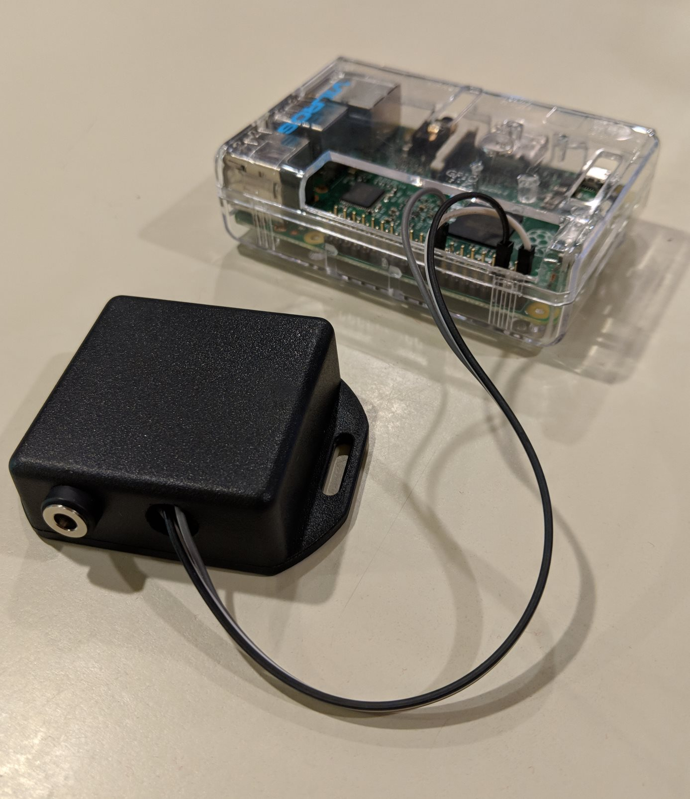

We wanted to camp overnight in our 2018 Chrysler Pacifica Hybrid. If the van is plugged in or the battery is charged enough, the climate system can run overnight without the engine turning on. 

Unfortunately, the van turns itself off after 30 minutes if left in Park (or while charging). We built a simple device which turns the van off and on again every 28 minutes, so that the climate system stays on all night.

[See Documentation](https://vscottlouvau.github.io/PacControl/)

